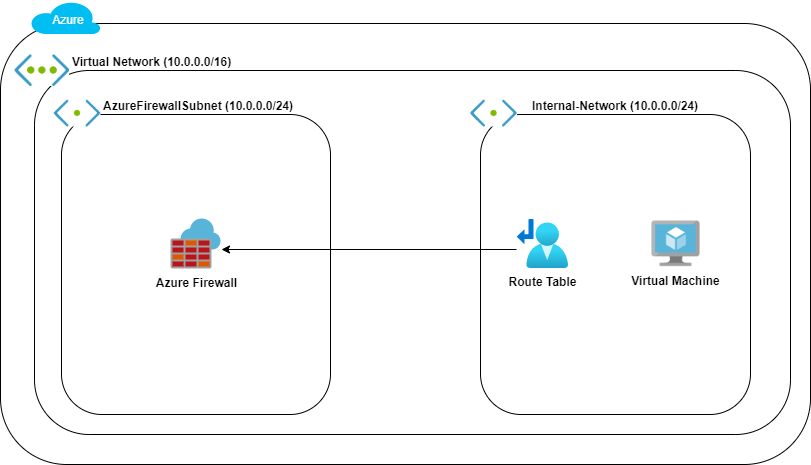

# Azure Firewall
Type of challenge : **Learning/Practice**

Duration : **1 hour**

Team Challenge : **solo**

## Introduction
Azure Firewall is a stateful firewall service that is hosted in Azure. It provides a highly available firewall solution that is also extremely scalable.  The Azure Firewall service also provides logging and metrics on the network traffic of virtual networks among subscriptions. There are many types of filtering, such as Application FQDN and Network filtering. There is even threat intelligence filtering, which is a feature that can be enabled to alert or block traffic from/to known malicious IP addresses and domains. Azure Firewall can be combined with Virtual Desktop Infrastructure (VDI) deployments on Azure to create a secure work remote work environment for businesses. 

In this lab, you will deploy and configure an Azure Firewall and create rules for resources on an internal network.

### Learning objective
- Understand the concept of a stateful firewall
- Learn how to deploy the Azure Firewall service
- Create rules to allow and secure access to an internal network in Azure

## Your mission
Let's say you are working at Becloud as a CloudSecurity engineer, and you have been asked to make sure that a particular linux virtual machine is only accessible trough a firewall. Which means that no direct access (via public ip) should be possible. You have been given this image for you to understant what the architechture should look like :

To help you do that you can refer to one of the two links :

- [Tutorial: Filter inbound Internet traffic with Azure Firewall DNAT using the Azure portal](https://docs.microsoft.com/en-us/azure/firewall/tutorial-firewall-dnat)
- [Cloudacademy : Deploying and Configuring Azure Firewall](https://cloudacademy.com/lab/deploying-and-configuring-azure-firewall/)

## Trusty Resources
- [What is Azure Firewall?](https://docs.microsoft.com/en-us/azure/firewall/overview)
